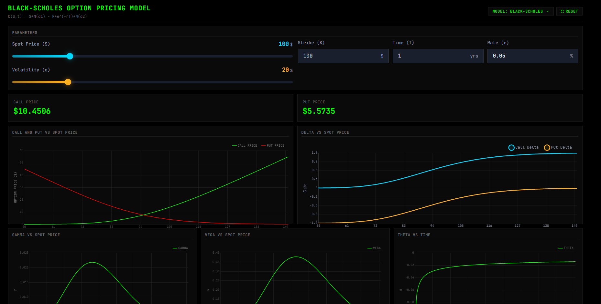
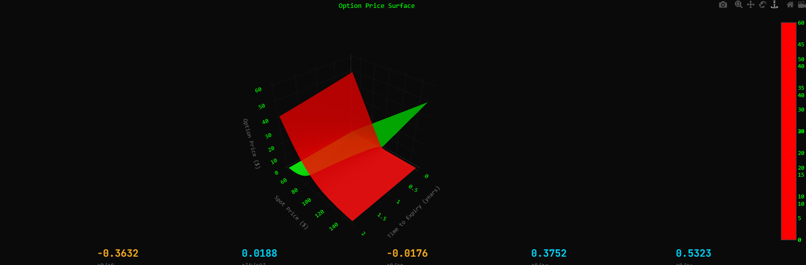

# 🎯 Pricing Models Visualizer

### *Interactive Financial Modeling & Visualization Platform*

---

## ✨ Features

| 🎨 **Visualization** | 📊 **Models** | 🔧 **Tools** |
|:---:|:---:|:---:|
| 3D Surface Charts | Black-Scholes | Real-time Greeks |
| Interactive Plots | Binomial Tree | Parameter Sliders |
| Dynamic Charts | Monte Carlo | Live Calculations |

---

---

## 📸 Screenshots

### Black-Scholes Model

*Interactive Black-Scholes pricing with real-time Greeks calculation*

---

## 📦 Key Components

- **`BlackScholesVisualizer`** - Interactive Black-Scholes model with Greeks
- **`BinomialVisualizer`** - Binomial tree option pricing
- **`MonteCarloVisualizer`** - Monte Carlo simulation visualizer
- **`Surface3DChart`** - 3D volatility surface visualization
- **`GreeksChart`** - Real-time Greeks (Delta, Gamma, Theta, Vega)

---

**Built with ❤️ for quantitative finance**

[⬆ Back to Top](#-pricing-models-visualizer)

